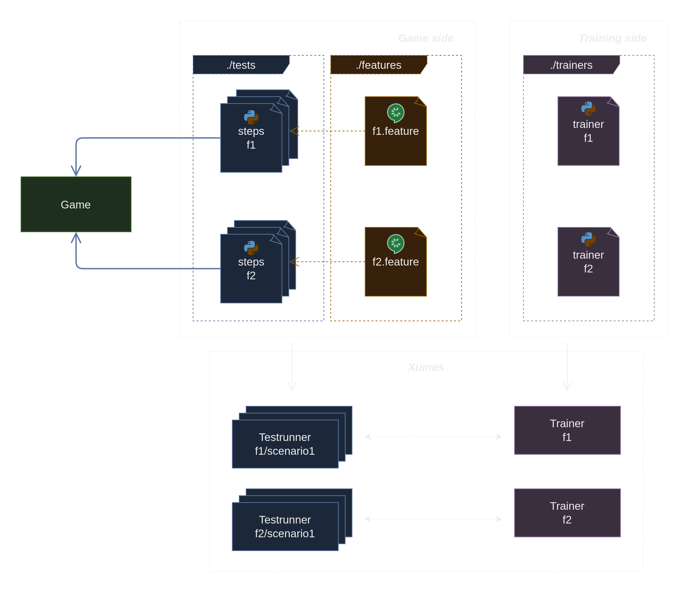

# Xumes

Xumes is a game testing tool designed to be used on top of games without the need to modify the game sources. It provides a framework for observing and interacting with game elements, training models, and conducting tests.

Please check the [documentation](https://xumes.readthedocs.io/en/latest/) for more information.

## Framework usage
The Xumes framework consists of two main components: the "Game side" and the "Training side". These components are implemented as separate Python modules within the framework: `game_module` and `training_module`.
You will need to implement these modules to use the framework. The following diagram illustrates the architecture of the framework:

### Game side
The steps files and features files are responsible for implementing the tests that will be executed by the framework. They are written in Gherkin, a language that allows you to write tests in a human-readable format. The framework will execute these tests by interacting with the game through the game side component.

### Training side
The training side of the Xumes framework is responsible for predicting actions based on game states. It leverages the `stablebaselines` library, which provides a wide range of reinforcement learning (RL) algorithms to facilitate the implementation of the training process.

## Limitations

- Randomness of the tests due to the stochatic behaviour of AI agents. We are doing t-test and let the user choose $\alpha$, by default $\alpha=0.001$. That means that there are cases of false positives and false negatives which is not good for testing.
- Training time can be long, especially for big tests.

Those limitations make testing difficult and impose a good definition of the test cases.

## Future work

- [ ] Improve the error handling for the BDD (steps not written yet for instance).
- [ ] Change the Observable implementation.
- [ ] Add seed to perform same tests every times.
- [X] Add tags in feature files.
- [ ] Improve code coverage with unit tests.
- [ ] Create an architecture schema for the framework (not a usage schema).
- [ ] Improve the documentation with descriptions of every classs of the framework.
- [ ] Improve the documentation with advices on how to make good tests and how to choose good alphas.
- [ ] Convert the documentation to Sphynx.
- [ ] Add a class to pass data from game to training (for the moment is Dict).
