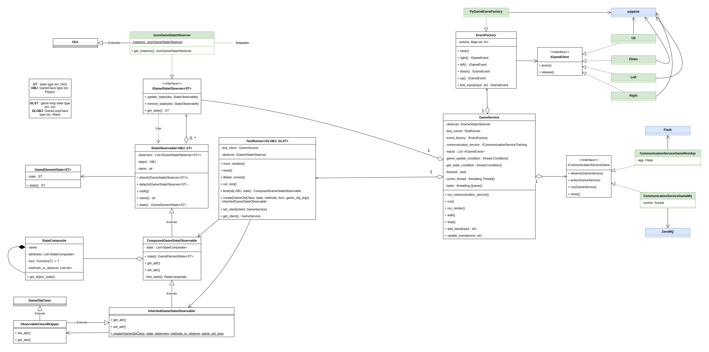
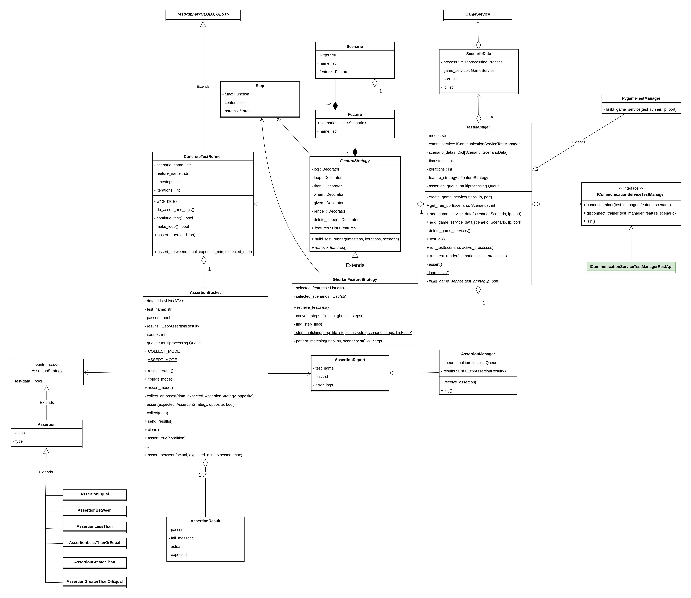
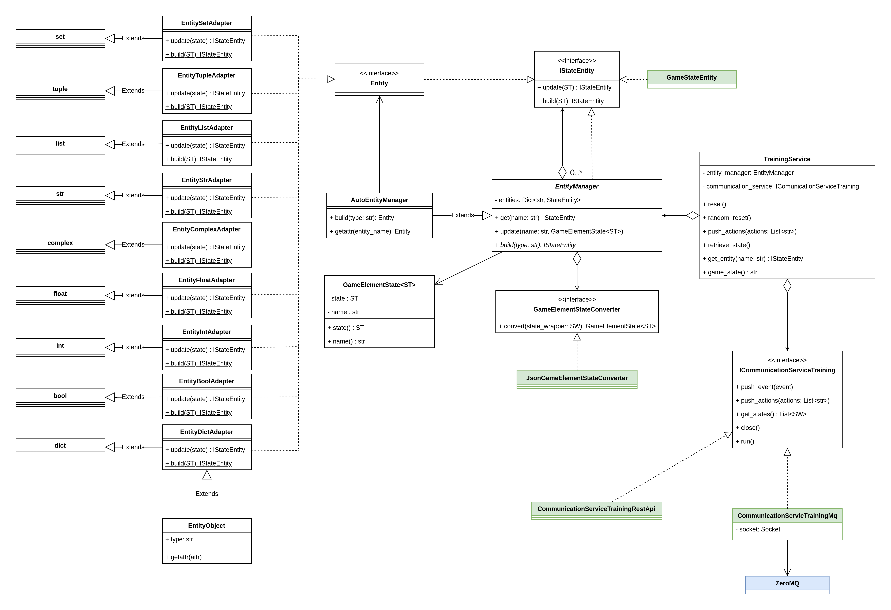
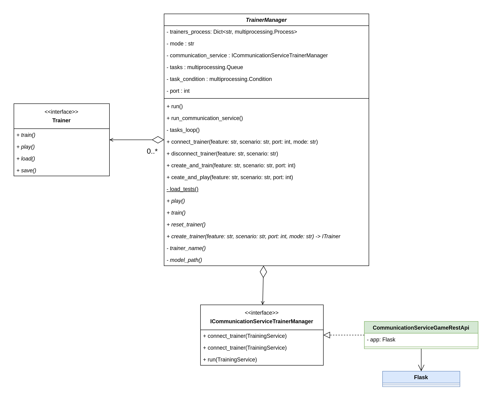
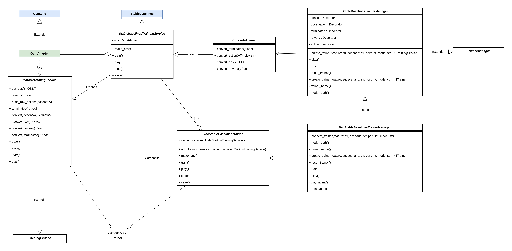

Architecture
============

This document describes the architecture of the project.

# Game side

## Test Runner Diagram

## Test Manager Diagram

# Training side

## Training Service Diagram

## Trainer Manager Diagram

## Stable Baselines Diagram

