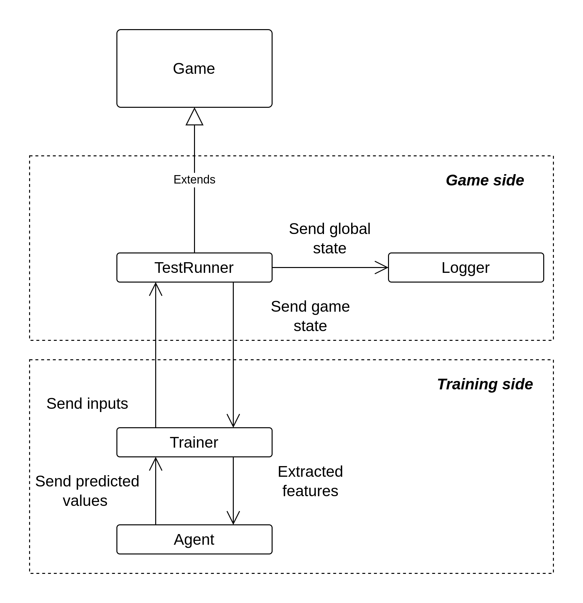

# Description

## Framework architecture
The Xumes framework consists of two main components: the "Game side" and the "Training side". These components are implemented as separate Python modules within the framework: `game_module` and `training_module`.
To utilize the Xumes framework effectively, you will need to create two distinct Python executables, each corresponding to one of the components. 

### Game side
The game side of the Xumes framework is responsible for interacting with the game itself. Its primary responsibilities include sending the game state to the trainer, receiving actions from the trainer, and logging the global game state. This component directly extends the game implementation.

Here are some key aspects of the game side component:

- Interaction with the game: It retrieves the current state of the game and provides this information to the trainer for analysis and decision-making.
- Communication with the trainer: The game side sends the game state to the trainer, allowing it to make predictions and take actions based on the received state. It also receives actions from the trainer, which are then applied to the game to continue its execution.
- Logging the global game state: The game side is responsible for logging the global game state. This may involve capturing important metrics, recording game events, or tracking the progress of the game. 

[How to implement the game side?](implement_without_observables/game_side_without_observables.md)

### Training side
The training side of the Xumes framework is responsible for predicting actions based on game states. It leverages the `stablebaselines` library, which provides a wide range of reinforcement learning (RL) algorithms to facilitate the implementation of the training process.

[How to implement the training side?](implement_without_observables/training_side_without_observables.md)
