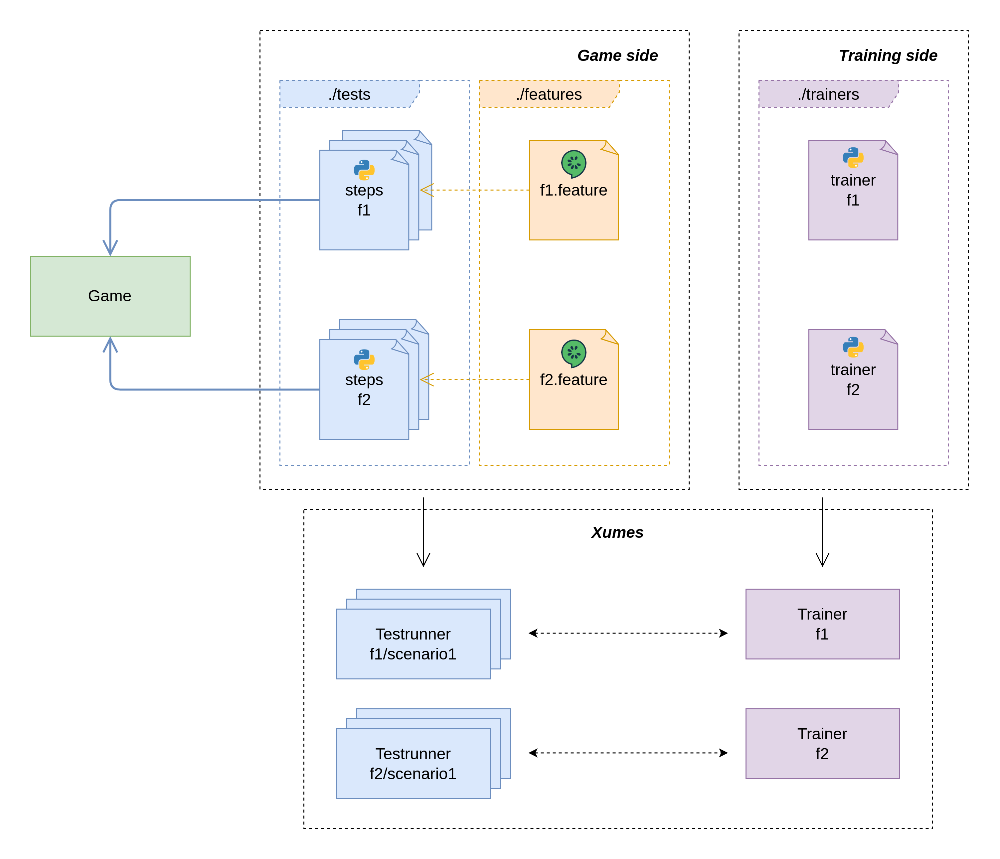

Quickstart
===========

The Xumes framework consists of two main components: the “Game side” and
the “Training side”. These components are implemented as separate Python
modules within the framework: ``game_module`` and ``training_module``.
You will need to implement these modules to use the framework. The
following diagram illustrates the architecture of the framework:

Game side
~~~~~~~~~

The steps files and features files are responsible for implementing the
tests that will be executed by the framework. They are written in
Gherkin, a language that allows you to write tests in a human-readable
format. The framework will execute these tests by interacting with the
game through the game side component.

`How to implement the steps files? <steps.md>`__

`How to implement the features file? <features.md>`__

Training side
~~~~~~~~~~~~~

The training side of the Xumes framework is responsible for predicting
actions based on game states. It leverages the ``stablebaselines``
library, which provides a wide range of reinforcement learning (RL)
algorithms to facilitate the implementation of the training process.

`How to implement the trainers? <trainers.md>`__
