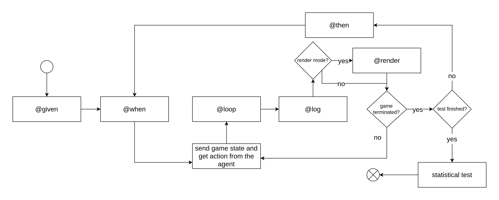

Steps files
===========

The steps files are responsible for implementing the tests that will be
executed by the framework. They are written in Gherkin, a language that
allows you to write tests in a human-readable format. The framework will
execute these tests by interacting with the game through the game side
component.

Each step file while require to implement the following methods using
python decorators:

.. method:: @given(step_description)

   :param str step_description: The description of the given step.
   :type: Method
   :description: This method will be executed before each test. It is responsible for setting up the game state before the test starts.

.. method:: @when(step_description)

   :param str step_description: The description of the when step.
   :type: Method
   :description: This method will be executed just before the game loop. It is responsible for setting up the game state before the game loop starts and for resetting the game state after each test.

.. method:: @loop

   :type: Method
   :description: This method will be executed at each iteration of the game loop. It is responsible for executing the actions predicted by the training side and updating the game state.

.. method:: @then(step_description)

   :param str step_description: The description of the then step.
   :type: Method
   :description: This method will be executed after the game loop. It is responsible for asserting the expected game state after the test is finished.

.. method:: @log

   :type: Method
   :description: This method will be executed after each iteration of the game loop. It is responsible for logging the game state if you want the game to be logged.

.. method:: @render

   :type: Method
   :description: This method will be executed after each iteration of the game loop. It is responsible for rendering the game state if you want the game to be rendered.

.. method:: @delete_screen

   :type: Method
   :description: This method will be executed before the test. It is responsible for deleting the screen if possible.

.. note:: The ``given``, ``when`` and ``then`` decorators can handle
   arguments.

The following diagram illustrates the execution flow of the steps files:

   test execution flow

1. ``@given``
-------------

This method will instantiate the game and set up the game state before
the test starts. You will need to define each variable that we want to
observe during the training process. An observable is a variable that
will notify his updates during the game loop. The framework will use
these updates to train the agent.

To observe a variable, you have two options:

Create an Observable
~~~~~~~~~~~~~~~~~~~~

.. method:: create(object_constructor,name,state=None,*args,**kwargs)

   :param ObjType object_constructor: The type of the object to observe.
   :param str name: The name of the observable.
   :param Optional[Union[State, List[State]]] state: The state of the observable.
   :param Any \*args: The arguments to pass to the constructor.
   :param Any \**kwargs: The keyword arguments to pass to the constructor.
   :return: `ObservableClassWrapper` The game object wrapped in the observable.
   :description: This method will create an observable. The object will be created by the game.

Bind an Object to an Observable
~~~~~~~~~~~~~~~~~~~~~~~~~~~~~~~

.. method:: bind(object,name,state=None)

   :param Any object: The object to observe.
   :param str name: The name of the observable.
   :param Optional[Union[State, List[State]]] state: The state of the observable.
   :return: `ObservableClassWrapper` The game object wrapped in the observable.
   :description: This method will bind an object to an observable. The object will be observed through reflection.

Here is an example of a ``@given`` method:

.. code:: python

   @given('the game is set up')
   def test_impl(test_context):
       test_context.game = Game()
       test_context.game.player = test_context.create(Player, 'player', state=State('position'), position=(0, 0))
       test_context.game.enemy = test_context.bind(test_context.game.enemy, 'enemy', state=State('position'))

**When do we need to use ``test_context.bind()``?**

When you want to observe an object that is already created by the game.
For instance, if you want to observe a list that is already created by
the game.

**When do we need to use ``test_context.create()``?**

When you want to observe an object that is not created by the game. For
instance, if you want to observe one object like the player.

.. important:: It’s better to use ``test_context.create()`` because
   ``test_context.bind()`` is using reflection to call the methods of
   the inner object. That’s mean you can lose some information about the
   object (like if the object is calling itself).

Ok but what is the state parameter?

State
~~~~~

The purpose of the state is to represent the state of a game object. The
state follows the Composite pattern, meaning it can contain other
states. The state representation should ultimately reach primitive types
such as integers, floats, strings, booleans, or collections of
primitives.

.. class:: State

   :param str name: The name of the state.
   :param Optional[Union[State, List[State]]] attributes: The list of attributes to get.
   :param Callable func: The function to apply to the representation.
   :param Optional[Union[str, List[str]]] methods_to_observe: The list of methods to observe.
   :description: This class represents a state.

Here is an example of a simple state that retrieves the attribute ``a``
of a game object.

.. code:: python

   State("a")

You can also create more complex states that retrieve attributes from
nested objects. For instance, the following state retrieves the
attribute ``a`` of the observed object with ``b``, and ``c`` from the
``a`` object.

.. code:: python

   State("a", [State("c"), State("b")])

..

.. important:: If you don’t provide a representation of an object,
   the framework will return the object itself. That’s mean you must
   either give a representation with ``State`` or give a ``func`` to
   ``State`` to represent the object as in the example at the bottom.

Observing setters
^^^^^^^^^^^^^^^^^

When creating a ``State``, you define attributes to observe. If an
attribute of the Observable is set, the state will be updated and you
don’t need to use ``methods_to_observe``.

.. code:: python

   class A:
     
     def __init__(self):
       self.a = 0
         
     def update(self):
       self.a += 1

   a = test_context.create(A, "a", State("a"))    

In this example, when ``a.update()`` is called, the state “a” will be
updated even if we don’t use ``methods_to_observe``.

.. note:: This can be useful for primitives attributes.

..

.. important:: This is not working for deeper attributes. For
   instance, if you have ``State("a", State("b"))``, the state “b” will
   not be updated if ``a.b`` is set, because ``b`` is not an attribute
   of ``A`` which is the observable.

Observing Methods
^^^^^^^^^^^^^^^^^

When creating a ``State``, you can specify a list of methods to observe.
An observed method is a method inside the game object that can trigger
state updates.

.. code:: python

   self.obj = self.create(Obj, "obj", State("a", methods_to_observe=["method"]))

In this example, when the ``self.obj.method`` is called, the state “a”
will be updated.

.. important:: ``methods_to_observe`` are methods of the Observable.

.. code:: python

   class A:
       def __init__(self):
           self.b = B()
    
       def method_a(self):
           self.b.method_b()
   class B:
       def method_b(self):
           self.c=0

   a = test_context.create(A, "a", State("b", State("c", methods_to_oberve="method_a")))

In this example, when ``a.method_a()`` is called, the state “c” will be
updated. And you **can’t** observe ``method_b`` because it’s not a
method of ``A``.

You can be more specific and provide a list of observed methods for each
state.

.. code:: python

   self.obj = self.create(Obj, "obj", State("a", State("b", methods_to_observe=["method", "method2"])))

Here, when ``self.obj.method`` or ``self.obj.method2`` are called, the
state “b” will be updated.

.. important:: Be caution when choosing the methods to observe,
   specially if you are observing primitive types. For instance, if you
   observe a list, ``li[0] = 1`` doesn’t trigger ``__setitem__`` as the
   non-primitive type does.

Representation Function
^^^^^^^^^^^^^^^^^^^^^^^

A ``State`` object can also have a representation function. This
function is called whenever the state is updated, allowing you to modify
the state’s representation. To be more precise, the function is called
on the result of the representation of the state’s children.

To clarify, here is a list of different cases that can occur:

-  If the child is an object without representation, the result is the
   object itself.
-  If the child is an object with representation, the result is a
   ``dict`` object, where keys are attributes of the child object.
-  If the child is a collection of objects without representation, the
   result is a collection of objects.
-  If the child is a collection of objects with representation, the
   result is a collection of ``dict`` objects.
-  If the child is a primitive type, the result is the value of the
   primitive type.

.. code:: python

   self.obj = self.create(Obj, "obj", State("a", func=lambda x: x + 1))

In this example, when the “a” state is updated, the value will be
incremented by 1 in its representation.

Observing Different Types of Attributes
^^^^^^^^^^^^^^^^^^^^^^^^^^^^^^^^^^^^^^^

The ``bind`` method supports observing different types of attributes:

-  Objects (as seen before)
-  Lists
-  Dictionaries
-  Tuples

Please note that you cannot directly observe ``int``, ``float``,
``bool``, or ``str`` attributes because they require re-instantiation
when updated.

However, you can observe ``list``, ``dict``, and ``tuple`` attributes
since they are mutable. If you want to re-instantiate them, you’ll need
to rebind them using the ``bind`` method.

For example, let’s say you have a list ``self.my_list``, and you want to
observe the attribute ``a`` of each object within the list:

.. code:: python

   self.my_list = self.bind(self.my_list, "my_list", State("a"))

..

.. note:: We use ``self.bind`` instead of ``self.create`` because we
   want to observe an existing object.

In this case, for every element in ``self.my_list``, the ``a`` attribute
will be observed.

Consider a class ``A``:

.. code:: python

   class A:
       def __init__(self, a):
           self.a = a

If you have a list of ``A`` objects:

.. code:: python

   self.my_list = [A(1), A(2), A(3)]

You will be able to access the ``a`` attribute of each ``A`` object
within the list on the training side, like this:

.. code:: python

   self.my_list[0].a

More Complex Example
^^^^^^^^^^^^^^^^^^^^

A real use case
'''''''''''''''

Let’s say you have an object ``A`` that contains a list of objects
``B``. You want to observe the ``b`` attribute of each ``B`` object
while giving a representation of the ``B`` object just with its ``b``
value. And they are updated when the method ``update`` of the ``A``
class is called.

.. code:: python

   class A:
       def __init__(self, b_list):
           self.b_list = b_list

       def update(self):
           for b in self.b_list:
               b.update_state()

   class B:
       def __init__(self, b):
           self.b = b

       def update(self):
           self.b += 1

   self.a = A([B(1), B(2)])

You can achieve this as follows:

.. code:: python

   self.a = self.bind(self.a, "a",
                      State("b_list", State("b", methods_to_observe=["update"]), func=lambda x: [b["b"] for b in x]))

or,

.. code:: python

   self.a = self.bind(self.a, "a", State("b_list", func=lambda x: [b.b for b in x], methods_to_observe=["update"]))

Explanation:

In the first case, we provide a representation of every element of the
``b_list`` with ``State("b", methods_to_observe=["update"])``. So when
we compute the representation of the ``b_list``, we will have a list of
``dict`` objects with the key ``b`` and the value of the ``b`` attribute
of the ``B`` object. Then we provide a representation function to the
``b_list`` state with ``func=lambda x: [b["b"] for b in x]``.

In the second case, we provide a representation function to the
``b_list`` state with ``func=lambda x: [b.b for b in x]``. Since we
didn’t provide a representation of every element of the ``b_list``, the
representation returns all the ``B`` objects. So we need to give a
representation function to the ``b_list`` state to return a list of
``b`` attributes of the ``B`` objects. Then we give a list of observed
methods to the ``b_list`` state with ``methods_to_observe=["update"]``.

In both cases you will be able to use the ``b_list`` attribute of the
``A`` object on the training side like this:

.. code:: python

   self.a.b_list[0]  # returns 1

To completely understand
''''''''''''''''''''''''

.. code:: python

   class A:
       def __init__(self, b_list):
           self.b_list = b_list

   class B:
       def __init__(self, c_list):
           self.c_list = c_list

   class C:
       def __init__(self, c):
           self.c = c

   self.a = A([B([C(1), C(2)]), B([C(3)])])

.. code:: python

   self.a = self.bind(self.a, "a", State("b_list",
                                         State("c_list",
                                               State("c", methods_to_observe=["update"])),
                                         func=lambda x: [[c["c"] for c in b["c_list"]] for b in x]))

.. code:: python

   self.a = self.bind(self.a, "a", State("b_list",
                                         State("c_list", methods_to_observe=["update"],
                                               func=lambda x: [c.c for c in x]),
                                         func=lambda x: [b["c_list"] for b in x]))

.. code:: python

   self.a = self.bind(self.a, "a", State("b_list", func=lambda x: [[c.c for c in b.c_list] for b in x]),
                      methods_to_observe=["update"])

Those representations are equivalent and will return the same result on
the training side:

.. code:: python

   self.a.b_list = [[1, 2], [3]]

2. ``@when``
------------

The ``@when`` decorator is used to define the conditions under which a
test is executed. As you can see on the schema, it will be executed
every time a game is terminated.

.. code:: python

   @when("The player is in the room with the monster")
   def test_impl(test_context):
       test_context.monster.room = test_context.player.room

3. ``@loop``
------------

The ``@loop`` decorator is used to define the game loop of our test.
It’s useful to update the game.

.. code:: python

   @loop
   def test_impl(test_context):
       test_context.game.update_state()

4. ``@then``
------------

The ``@then`` decorator is used to define the conditions under which a
test is successful. As you can see on the schema, it will be executed
every time a game is terminated. You have a list of ``assertion``
functions that you can use to define your conditions.

.. code:: python

   @then("The player killed the monster")
   def test_impl(test_context):
       test_context.assert_true(test_context.monster.is_dead)

Assertion functions
~~~~~~~~~~~~~~~~~~~

.. method:: assert_true(condition)

   :param condition: The condition to assert.
   :description: Asserts that ``condition`` is ``True``.

.. method:: assert_false(condition)

   :param condition: The condition to assert.
   :description: Asserts that ``condition`` is ``False``.

.. method:: assert_equal(actual, expected)

   :param actual: The actual value.
   :param expected: The expected value.
   :description: Asserts that ``actual`` is equal to ``expected``.

.. method:: assert_not_equal(actual, expected)

   :param actual: The actual value.
   :param expected: The expected value.
   :description: Asserts that ``actual`` is not equal to ``expected``.

.. method:: assert_greater(actual, expected)

   :param actual: The actual value.
   :param expected: The expected value.
   :description: Asserts that ``actual`` is greater than ``expected``.

.. method:: assert_greater_equal(actual, expected)

   :param actual: The actual value.
   :param expected: The expected value.
   :description: Asserts that ``actual`` is greater than or equal to ``expected``.

.. method:: assert_less(actual, expected)

   :param actual: The actual value.
   :param expected: The expected value.
   :description: Asserts that ``actual`` is less than ``expected``.

.. method:: assert_less_equal(actual, expected)

   :param actual: The actual value.
   :param expected: The expected value.
   :description: Asserts that ``actual`` is less than or equal to ``expected``.

.. method:: assert_between(actual, min, max)

    :param actual: The actual value.
    :param min: The minimum value.
    :param max: The maximum value.
    :description: Asserts that ``actual`` is between ``min`` and ``max``.

.. method:: assert_not_between(actual, min, max)

    :param actual: The actual value.
    :param min: The minimum value.
    :param max: The maximum value.
    :description: Asserts that ``actual`` is not between ``min`` and ``max``.

Example:

.. code:: python

   test_context.assert_false(test_context.monster.is_dead)
   test_context.assert_not_between(test_context.player.health, 0, 100)

5. ``@render``
--------------

The ``@render`` decorator is used to define the rendering of the game.
It’s useful to see the game in action.

.. code:: python

   @render
   def test_impl(test_context):
       test_context.game.render()

6. ``@delete_screen``
---------------------

The ``@delete_screen`` decorator is used to delete the screen of the
game. It’s made to avoid space and compute waste but it’s not mandatory.

.. code:: python

   @delete_screen
   def test_impl(test_context):
       test_context.game.delete_screen()

7. ``@log``
-----------

The ``@log`` decorator is used to log the game.

.. code:: python

   @log
   def test_impl(test_context):
       return {
           "player_health": test_context.player.health,
           "monster_health": test_context.monster.health
       }
