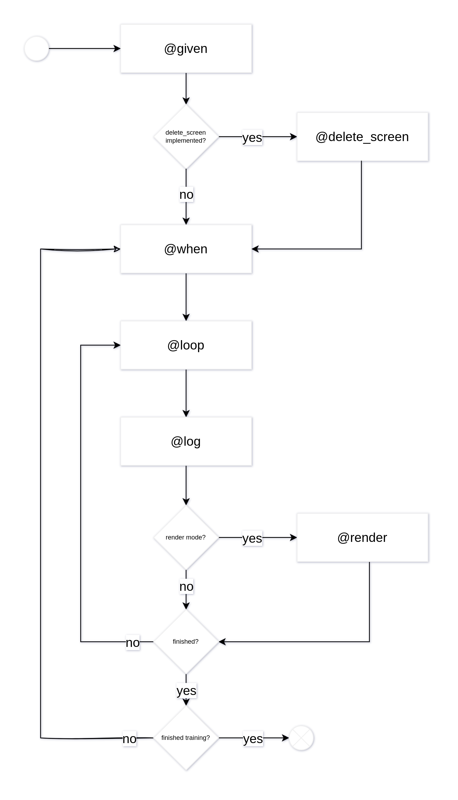

# Steps files

The steps files are responsible for implementing the tests that will be executed by the framework. They are written in Gherkin, a language that allows you to write tests in a human-readable format. The framework will execute these tests by interacting with the game through the game side component.

Each step file while require to implement the following methods using python decorators:

- `@given`: This method will be executed before each test. It is responsible for setting up the game state before the test starts.
- `@when`: This method will be executed just before the game loop. It is responsible for setting up the game state before the game loop starts.
- `@loop`: This method will be executed at each iteration of the game loop. It is responsible for executing the actions predicted by the training side and updating the game state.
- `@then`: This method will be executed after the game loop. It is responsible for asserting the expected game state after the test is finished.
- `@render`: This method will be executed after each iteration of the game loop. It is responsible for rendering the game state if you want the game to be rendered.
- `@delete_screen`: This method will be executed before the test. It is responsible for deleting the screen if possible.
- `@log`: This method will be executed after each iteration of the game loop. It is responsible for logging the game state if you want the game to be logged.

The following diagram illustrates the execution flow of the steps files:




# 1. `@given`

This method will instantiate the game and set up the game state before the test starts.
You will need to define each variable that we want to observe during the training process.

An observable is a variable that will notify his updates during the game loop. The framework will use these updates to train the agent.

Here is an example of a `@given` method:

```python
@given('the game is set up')
def test_impl(test_context):
    test_context.game = Game()
    test_context.game.player = test_context.bind(test_context.game.player, 'player', state)
```

Ok but what is the state parameter?


## State

The purpose of the state is to represent the state of a game object. The state follows the Composite pattern, meaning it can contain other states. The state representation should ultimately reach primitive types such as integers, floats, strings, booleans, or collections of primitives.

Here is an example of a simple state that retrieves the attribute `a` of a game object.

```python
State("a")
```

You can also create more complex states that retrieve attributes from nested objects. For instance, the following state retrieves the attribute `a` of the observed object with `b`, and `c` from the `a` object.

```python
State("a", [State("c"), State("b")])
```

> **_IMPORTANT:_** If you don't provide a representation of an object, the framework will return the object itself. That's mean you must either give a representation with `State` or give a `func` to `State` to represent the object as in the example at the bottom.

### Observing Methods

When creating a `State`, you can specify a list of methods to observe. An observed method is a method inside the game object that can trigger state updates.

```python
self.obj = self.bind(self.obj, "obj", State("a", methods_to_observe=["method"]))
```

In this example, when the `self.obj.method` is called, the state "a" will be updated.

You can be more specific and provide a list of observed methods for each state.

```python
self.obj = self.bind(self.obj, "obj", State("a", State("b", methods_to_observe=["method", "method2"])))
```

Here, when `self.obj.method` or `self.obj.method2` are called, the state "b" will be updated.

### Representation Function

A `State` object can also have a representation function. This function is called whenever the state is updated, allowing you to modify the state's representation.
To be more precise, the function is called on the result of the representation of the state's children.

To clarify, here is a list of different cases that can occur:

- If the child is an object without representation, the result is the object itself.
- If the child is an object with representation, the result is a `dict` object, where keys are attributes of the child object.
- If the child is a collection of objects without representation, the result is a collection of objects.
- If the child is a collection of objects with representation, the result is a collection of `dict` objects.
- If the child is a primitive type, the result is the value of the primitive type.

```python
self.obj = self.bind(self.obj, "obj", State("a", func=lambda x: x + 1))
```

In this example, when the "a" state is updated, the value will be incremented by 1 in its representation.

### Observing Different Types of Attributes

The `bind` method supports observing different types of attributes:

- Objects (as seen before)
- Lists
- Dictionaries
- Tuples

Please note that you cannot directly observe `int`, `float`, `bool`, or `str` attributes because they require re-instantiation when updated.

However, you can observe `list`, `dict`, and `tuple` attributes since they are mutable. If you want to re-instantiate them, you'll need to rebind them using the `bind` method.

For example, let's say you have a list `self.my_list`, and you want to observe the attribute `a` of each object within the list:

```python
self.my_list = self.bind(self.my_list, "my_list", State("a"))
```

In this case, for every element in `self.my_list`, the `a` attribute will be observed.

Consider a class `A`:

```python
class A:
    def __init__(self, a):
        self.a = a
```

If you have a list of `A` objects:

```python
self.my_list = [A(1), A(2), A(3)]
```

You will be able to access the `a` attribute of each `A` object within the list on the training side, like this:

```python
self.my_list[0].a
```

### More Complex Example

#### A real use case

Let's say you have an object `A` that contains a list of objects `B`. You want to observe the `b` attribute of each `B` object while giving a representation of the `B` object just with its `b` value. And they are updated when the method `update` of the `A` class is called.

```python
class A:
    def __init__(self, b_list):
        self.b_list = b_list

    def update(self):
        for b in self.b_list:
            b.update()

class B:
    def __init__(self, b):
        self.b = b

    def update(self):
        self.b += 1


self.a = A([B(1), B(2)])
```

You can achieve this as follows:

```python
self.a = self.bind(self.a, "a", State("b_list", State("b", methods_to_observe=["update"]), func=lambda x: [b["b"] for b in x]))
```
or,
```python
self.a = self.bind(self.a, "a", State("b_list", func=lambda x: [b.b for b in x], methods_to_observe=["update"]))
```

Explanation:

In the first case, we provide a representation of every element of the `b_list` with `State("b", methods_to_observe=["update"])`. So when we compute the representation of the `b_list`, we will have a list of `dict` objects with the key `b` and the value of the `b` attribute of the `B` object. Then we provide a representation function to the `b_list` state with `func=lambda x: [b["b"] for b in x]`.

In the second case, we provide a representation function to the `b_list` state with `func=lambda x: [b.b for b in x]`. Since we didn't provide a representation of every element of the `b_list`, the representation returns all the `B` objects. So we need to give a representation function to the `b_list` state to return a list of `b` attributes of the `B` objects. Then we give a list of observed methods to the `b_list` state with `methods_to_observe=["update"]`.


In both cases you will be able to use the `b_list` attribute of the `A` object on the training side like this:

```python
self.a.b_list[0] # returns 1
```

#### To completely understand

```python
class A:
    def __init__(self, b_list):
        self.b_list = b_list

class B:
    def __init__(self, c_list):
        self.c_list = c_list

class C:
    def __init__(self, c):
        self.c = c

self.a = A([B([C(1), C(2)]), B([C(3)])])
```


```python
self.a = self.bind(self.a, "a", State("b_list", 
                                 State("c_list", 
                                       State("c", methods_to_observe=["update"])), 
                                 func=lambda x: [[c["c"] for c in b["c_list"]] for b in x]))
```

```python
self.a = self.bind(self.a, "a", State("b_list", 
                                 State("c_list", methods_to_observe=["update"], 
                                       func=lambda x: [c.c for c in x]),      
                                 func=lambda x: [b["c_list"] for b in x]))
```

```python
self.a = self.bind(self.a, "a", State("b_list", func=lambda x: [[c.c for c in b.c_list] for b in x]), methods_to_observe=["update"])
```


Those representations are equivalent and will return the same result on the training side:

```python
self.a.b_list = [[1, 2], [3]]
```


